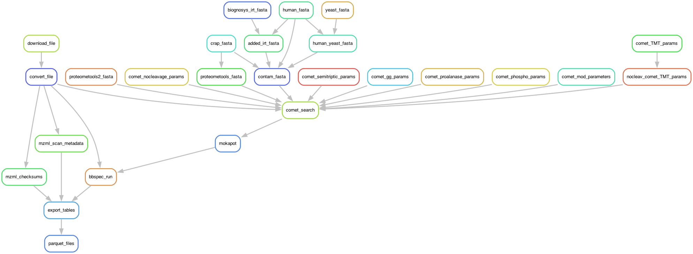

# Preparing the data for ElFragmentador

Implements a workflow to go from raw mass spec files -> prepare parameters ->
prepare fasta -> run search -> rescore -> filter -> generate spectral libs ->
post-process -> de-duplicate.

1. raw mass spec files from pride
2. prepare parameters ... manually
3. run search uisng comet
4. rescore using mokapot
5. filter using pandas
6. generate spectral libs using bibliospec
7. post-process using pandas
8. de-duplicate using ms2ml
9. encode using ms2ml

This bundle of snakemake rules has exploded to a point beyond maintainability but
it still works. There is a lot of orphan code sections and the code is not pretty.

In the near future I will translate this to nextflow and make it more modular.

Nonthelees, here go some instructions on how to use it.

## Run as ...

The main environment where I am running this is a SLURM cluster from purdue, so the main way to run it is calling it as ....

```bash
bash RUN.bash bibliospec_stuff scan_metadata parquet_files
```

To display the graph

```
$ snakemake --config tsv_file=target_files/train_all.tsv -s workflow.smk parquet_files --dag --dry-run | dot -Tpng > full_dag.png
```




## Output

Right now it outputs the tables from a bibliospec library as parquet files, which need to be post-processed to make it trainable.

## Resources

Disk usage:

1. Raw Files
    - 2.7T
2. mzML files
    - 1.2T
3. comet outputs
    - 274G
4. mokapot outputs
    - 27G
5. redundant bibliospec outputs
    - 50G
6. parquet files
    - 33G
7. Processed Parquet files
    - 1GB

## Setting up msconvert on singularity ...

If you can use docker ... use it.

Locally build an image ... (in your laptop ...)

```bash
singularity build --sandbox pwiz_sandbox docker://chambm/pwiz-skyline-i-agree-to-the-vendor-licenses
singularity exec -w pwiz_sandbox wine SkylineCmd.exe # Check that it works ...
tar --create --file pwiz_sandbox.tar pwiz_sandbox 
scp -r pwiz_sandbox.tar  {REMOTE_USER}@{REMOTE_SERVER}:${REMOTE_LOCATION}. # Copy to the cluster
```

In our cluster we have space in a scratch dir.. in my case

`/scratch/brown/jpaezpae/`

So i transfer it as such:

    scp -r pwiz_sandbox.tar  jpaezpae@172.18.32.43:/scratch/brown/jpaezpae/pwiz_sandbox/.   

Then I log into the cluster ... and from there ...

    cd /scratch/brown/jpaezpae/pwiz_sandbox
    tar -xf pwiz_sandbox.tar # Extract the image
    vim pwiz_sandbox/usr/bin/mywine

And I make sure it looks like this ....

```bash
#!/bin/sh

GLOBALWINEPREFIX=/wineprefix64
MYWINEPREFIX=/mywineprefix/

if [ ! -L "$MYWINEPREFIX"/dosdevices/z: ] ; then 
  mkdir -p "$MYWINEPREFIX"/dosdevices
  cp "$GLOBALWINEPREFIX"/*.reg "$MYWINEPREFIX"
  ln -sf "$GLOBALWINEPREFIX/drive_c" "$MYWINEPREFIX/dosdevices/c:"
  ln -sf "/" "$MYWINEPREFIX/dosdevices/z:"
  echo disable > $MYWINEPREFIX/.update-timestamp # this line prevents auto update
  echo disable > $GLOBALWINEPREFIX/.update-timestamp
fi 

export WINEPREFIX=$MYWINEPREFIX
wine "$@"

```

Once it looks like that, I need to create a directory for the wine prefix ...

    mkdir -p /scratch/brown/jpaezpae/pwiz_sandbox/pwiz_sandbox/mywineprefix

AND FINALLY we can run it as such ....

```bash
singularity exec \
    -B ${real_parent}/:/data \
    -B `mktemp -d /dev/shm/wineXXX`:/mywineprefix \
    -w /scratch/brown/jpaezpae/pwiz_sandbox/pwiz_sandbox \
    mywine msconvert \
        --zlib --64 \
        --filter "peakPicking true 1-" \
        --filter "activation HCD" \
        --filter "analyzer FT" \
        -o /data/ --verbose \
        "/data/$(basename $real_path)"
```